<div align="center">


**A two-vendor development lifecycle for Claude Code.**<br>
The expensive model orchestrates and judges, the cheap model does the volume,<br>
and no model's work ships on its own word.


</div>

---

## The roster — two voices, by design

| | 🟠 principal | 🔷 implementer |
|---|---|---|
| **Reference pair** | Claude Code session (e.g. `claude-fable-5`) | `codex exec` (default `gpt-5.6-sol`) |
| **Job** | Orchestrates every phase, holds the thread, reviews, adjudicates, and **verifies everything itself**. Writes glue, never bulk code. Also a blind panel voice via headless `claude -p`. | Implements in a workspace-write sandbox, and serves as the second blind voice in panels and reviews. Returns schema-forced results, never prose. |
| **Swap it** | any strong session model | `CONSORT_IMPL_MODEL` env var |

Cross-vendor is the point: two model families don't share blind spots (in the SWE-chat
4-tool study, 93.4% of issues were caught by exactly one tool). Every substantive
artifact gets touched by both.

## The pipeline

```mermaid
flowchart LR
    A["1 · interview<br/><i>scope + assumptions</i>"] --> B["2 · spec<br/><i>blind panel + synthesis</i>"]
    B --> C["3 · plan<br/><i>tasks + DoD, refuted</i>"]
    C --> D["4 · implement<br/><i>delegate, then verify</i>"]
    D --> E["5 · review<br/><i>blind duet, merged</i>"]
    E --> F["6 · gate<br/><i>no model: tests, CI</i>"]

    classDef both fill:#5fb47e,stroke:#3a8556,color:#10241a
    classDef principal fill:#d6934f,stroke:#a85f2c,color:#241505
    classDef impl fill:#43b4b4,stroke:#1c757b,color:#082222
    classDef gate fill:#9aa4b0,stroke:#5b6470,color:#14181d
    class A,B,E both
    class C principal
    class D impl
    class F gate
```



Each phase writes its artifact before advancing; any phase resumes from disk.

| # | Phase | Who acts | What happens | Artifact |
|---|---|---|---|---|
| 1 | **interview** 🚧 | 🟠 + 🔷 | Scope the request; the implementer proposes the questions the principal didn't ask | `interview.md` |
| 2 | **spec** 🚧 | 🟢 both, blind | Both voices draft **blind**; the principal scores and synthesizes, grafting the best of each with attribution | `spec.md` + both drafts |
| 3 | **plan** | 🟠 refuted by 🔷 | Decompose into tasks, each with a mechanical definition of done; the implementer refutes the plan | `plan.md` · `tasks.json` |
| 4 | **implement** | 🔷 types, 🟠 verifies | Delegate via five-part briefs; the principal runs every task's done-check itself | `tasks/*.result.json` |
| 5 | **review** | 🟢 both, blind | Both review the same diff; findings merge into *both-agree / principal-only / implementer-only* | `review.md` |
| 6 | **gate** | ⚙️ no model | Structural check that trusts nobody: tests, CI, sources untouched, claims traced | exit code |

🚧 = human gate (scope and spec). Everything between runs unattended.

## Install & use

```
/plugin marketplace add https://github.com/siimvene/consort
/plugin install consort@consort
```

Requires the `claude` and `codex` CLIs on PATH, `node`, and `git`. Sanity-check the
implementer: `codex exec -m gpt-5.6-sol "reply OK"` (override the model with
`CONSORT_IMPL_MODEL`).

```
/consort:run [workdir]    # the whole lifecycle on a repo containing REQUEST.md
/consort:review [base]    # cross-model review of the working diff
/consort:plan <task>      # cross-vendor plan refutation before code is written
```

Optional: point `CONSORT_RULE_PACKS` at your org's rule packs (colon-separated
files or dirs of `.md`/`.mdc`) — or vendor packs into the repo at
`.claude/rules/`, which is picked up automatically when the variable is unset.
Both reviewers — Codex via the script, the principal via the skill — review
against the same written standard. The packs live in your standards repo;
consort ships the mechanism, not the rubric.

Bootstrap a throwaway playground: `bash scripts/consort-demo.sh /tmp/consort-demo`

## Mechanics — what actually executes

| Piece | Does |
|---|---|
| `scripts/consort-delegate.sh` | Hands the implementer one task as a five-part brief (goal, paths, constraints, definition of done, return format); result is schema-forced JSON, logged to `.consort/tasks/` |
| `scripts/consort-consult.sh` | Read-only implementer with a schema: panel drafts, plan refutations, divergent questions |
| `scripts/consort-review.sh` + `merge-findings.mjs` | The duet: both voices review the same diff blind; the merge surfaces what only one model caught |
| `scripts/consort-gate.sh` | Model-free verdict — code: tests green; documents: sources untouched, claims traced |
| `schemas/` | One shared shape per artifact type (`spec`, `findings`, `task-result`) is what makes two vendors comparable and machine-mergeable |
| `.consort/` | The state bus: every phase resumes from disk; the session dying loses nothing |

## Codex backends

The scripts reach Codex through one of two backends, resolved by
`scripts/codex-backend.sh`:

- **plugin** — the official Codex Claude Code plugin's companion runtime
  (`codex-companion.mjs task`), auto-detected under
  `~/.claude/plugins/cache/*/codex/*`. Uses the plugin's shared runtime and
  session plumbing; consult/review run read-only, delegation runs
  workspace-write (`--write`). The output schema travels as a prompt contract
  and is extracted/validated locally (the runtime has no `--output-schema`).
- **exec** — the raw `codex exec` CLI (the original bridge), with native
  `--output-schema` enforcement.

Auto-resolution prefers the plugin when installed; force either with
`CONSORT_CODEX_BACKEND=plugin|exec`. Delegation entries in `.consort/log.jsonl`
record which backend served each task.

## The rules that keep it honest

1. **Whichever model authors, the other verifies.** A finding is a lead, not a verdict: it gets checked against reality before it's reported.
2. **The principal verifies everything itself.** "The implementer says done" is never the end; every definition of done names a mechanical check, and the principal runs it.
3. **State lives on disk, not in context.** Any phase is resumable from `.consort/`; provenance ships with the work.
4. **Disagreement is surfaced, not averaged.** Panel synthesis grafts with attribution; review divergence is shown, adjudicated, logged.

## Design docs

- [`SPEC.md`](SPEC.md) — goals, roster, phase pipeline, panel mechanism, delegation contract
- [`AGENTS.md`](AGENTS.md) — design rationale and roadmap

---

> The pattern that keeps proving itself: **the second vendor's blind pass always finds something the first one structurally can't see.** That column is why consort exists.
