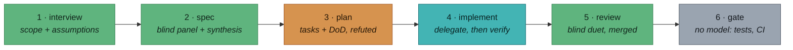

<div align="center">


**A two-vendor development lifecycle for Claude Code.**<br>
The expensive model orchestrates and judges, the cheap model does the volume,<br>
and no model's work ships on its own word.


</div>

---

## The roster — two voices, by design

| | 🟠 principal | 🔷 implementer |
|---|---|---|
| **Reference pair** | Claude Code session (e.g. `claude-fable-5`) | `codex exec` (default `gpt-5.6-sol`) |
| **Job** | Orchestrates every phase, holds the thread, reviews, adjudicates, and **verifies everything itself**. Writes glue, never bulk code. Also a blind panel voice via headless `claude -p`. | Implements in a workspace-write sandbox, and serves as the second blind voice in panels and reviews. Returns schema-forced results, never prose. |
| **Swap it** | any strong session model | model via `CONSORT_IMPL_MODEL`; whole vendor via `CONSORT_BACKEND=codex\|gemini\|pi` (Pi: any provider via `CONSORT_PI_PROVIDER`); several at once for review via `CONSORT_REVIEWERS` |

Cross-vendor is the point: two model families don't share blind spots (in the SWE-chat
4-tool study, 93.4% of issues were caught by exactly one tool). Every substantive
artifact gets touched by both.

## The pipeline


```mermaid
flowchart LR
    A["1 · interview<br/><i>scope + assumptions</i>"] --> B["2 · spec<br/><i>blind panel + synthesis</i>"]
    B --> C["3 · plan<br/><i>tasks + DoD, refuted</i>"]
    C --> D["4 · implement<br/><i>delegate, then verify</i>"]
    D --> E["5 · review<br/><i>blind duet, merged</i>"]
    E --> F["6 · gate<br/><i>no model: tests, CI</i>"]

    classDef both fill:#5fb47e,stroke:#3a8556,color:#10241a
    classDef principal fill:#d6934f,stroke:#a85f2c,color:#241505
    classDef impl fill:#43b4b4,stroke:#1c757b,color:#082222
    classDef gate fill:#9aa4b0,stroke:#5b6470,color:#14181d
    class A,B,E both
    class C principal
    class D impl
    class F gate
```

Each phase writes its artifact before advancing; any phase resumes from disk.

| # | Phase | Who acts | What happens | Artifact |
|---|---|---|---|---|
| 1 | **interview** 🚧 | 🟠 + 🔷 | Scope the request; the implementer proposes the questions the principal didn't ask | `interview.md` |
| 2 | **spec** 🚧 | 🟢 both, blind | Both voices draft **blind**; the principal scores and synthesizes, grafting the best of each with attribution | `spec.md` + both drafts |
| 3 | **plan** | 🟠 refuted by 🔷 | Decompose into tasks, each with a mechanical definition of done; the implementer refutes the plan | `plan.md` · `tasks.json` |
| 4 | **implement** | 🔷 types, 🟠 verifies | Delegate via five-part briefs; the principal runs every task's done-check itself | `tasks/*.result.json` |
| 5 | **review** | 🟢 both, blind | Both review the same diff; findings merge into *both-agree / principal-only / implementer-only* | `review.md` |
| 6 | **gate** | ⚙️ no model | Structural check that trusts nobody: tests, CI, sources untouched, claims traced | exit code |

🚧 = human gate (scope and spec). Everything between runs unattended.

## Dependencies

Consort does not work standalone. Before installing, you need:

1. **Codex CLI** — `codex` on PATH, authenticated. Sanity check:
   `codex exec -m gpt-5.6-sol "reply OK"` (override the model with
   `CONSORT_IMPL_MODEL`).
2. **Codex plugin for Claude Code** (recommended) — `codex@openai-codex` (from
   [openai/codex-plugin-cc](https://github.com/openai/codex-plugin-cc)). Consort's
   default backend is this plugin's companion runtime (see "Codex backends" below);
   without it consort falls back to raw `codex exec`, which loses session reuse.
3. **Claude Code**, plus `node` and `git` on PATH.

## Install & use

```
/plugin marketplace add https://github.com/siimvene/consort
/plugin install consort@consort
```

```
/consort:run [workdir]    # the whole lifecycle on a repo containing REQUEST.md
/consort:review [base]    # cross-model review of the working diff
/consort:plan <task>      # cross-vendor plan refutation before code is written
/consort:scan [workdir]   # model-free security scan (Trivy/Sonar), triaged
```

**Rule packs:** point `CONSORT_RULE_PACKS` at your org's rule packs (colon-separated
files or dirs of `.md`/`.mdc`) — or vendor packs into the repo at
`.claude/rules/`, which is picked up automatically when the variable is unset.
Both reviewers — Codex via the script, the principal via the skill — review
against the same written standard. Org coding standards live in your standards
repo; the plugin itself ships only vendor-neutral review methodology in its
`rules/` directory (`blast-surface.md`, `finding-discipline.md`, and
`security-review.md`, always injected since 0.4.0, no setup needed).

**Diff excludes (opt-in):** every diff byte is re-sent on every reviewer turn,
so a repo that commits generated artefacts (baseline JSON, bundles) can name
them in `CONSORT_DIFF_EXCLUDE` (colon-separated git pathspec globs, matched
from the repo root). Nothing is excluded by default — lockfiles stay in,
because the supply-chain rule in `security-review.md` needs the model to see
dependency changes. Excluded paths are listed on stderr and handed to the
reviewer as fenced data; a diff that is empty only because of excludes exits
4, not 0. Whoever sets the variable owes the principal the same excludes, or
the two sides stop reviewing the same diff.

**Security scanners (optional):** when [Trivy](https://trivy.dev) is on PATH,
`consort-scan.sh` adds a deterministic third voice to every review — dependency
CVEs, leaked secrets, IaC misconfigurations — emitted in the same findings
schema the models use. A [SonarQube](https://www.sonarsource.com) leg joins it
when a server is reachable (`SONAR_HOST_URL`, default `http://localhost:9000`),
`SONAR_TOKEN` is set, and the repo has a `sonar-project.properties`. Neither is
required; every skipped scanner is reported loudly, never silently. Rule-based
scanners and model reviewers catch nearly disjoint defect sets — that
zero-overlap is why both tiers run.

**Security side-agent:** the plugin also ships an `agents/security-reviewer`
subagent — a blind, security-only reviewer the review loop spawns in parallel
with the cross-vendor pass. It inherits no session context, so it reads the
diff without the author's assumptions; its findings merge as their own column
and are verified like any cross-model lead.

Bootstrap a throwaway playground: `bash scripts/consort-demo.sh /tmp/consort-demo`

## Mechanics — what actually executes

| Piece | Does |
|---|---|
| `scripts/consort-delegate.sh` | Hands the implementer one task as a five-part brief (goal, paths, constraints, definition of done, return format); result is schema-forced JSON, logged to `.consort/tasks/` |
| `scripts/consort-consult.sh` | Read-only implementer with a schema: panel drafts, plan refutations, divergent questions |
| `scripts/consort-review.sh` + `merge-findings.mjs` | The duet: both voices review the same diff blind; the merge surfaces what only one model caught |
| `scripts/consort-panel.sh` | The panel: `consort-review.sh` once per leg of `CONSORT_REVIEWERS` (e.g. `codex,pi:google-vertex`), in parallel, one findings file per leg; a leg that fails or times out fails the panel; `merge-findings.mjs` takes all the legs at once |
| `scripts/consort-scan.sh` + `scan-to-findings.mjs` | Model-free scanner tier: Trivy (vulns, secrets, misconfig) and SonarQube (when a server is configured), converted into the shared findings schema |
| `scripts/consort-gate.sh` | Model-free verdict — code: tests green; documents: sources untouched, claims traced |
| `schemas/` | One shared shape per artifact type (`spec`, `findings`, `task-result`) is what makes two vendors comparable and machine-mergeable |
| `.consort/` | The state bus: every phase resumes from disk; the session dying loses nothing |

## Backends

The implementer/reviewer ("sol") runs on one of three backends, chosen at
will with `CONSORT_BACKEND` (default `codex`): `codex` and `gemini` are
non-Anthropic by construction, so either satisfies the cross-vendor axis when
the principal is Claude; `pi` reaches whichever provider `CONSORT_PI_PROVIDER`
names and refuses `anthropic` unless you state the principal is not Claude.
`scripts/consort-backend.sh` is the dispatcher the caller scripts source.

### Panel — more than one reviewer per diff (`CONSORT_REVIEWERS`)

`CONSORT_BACKEND` picks one backend for everything. A review gate that wants
two vendors' readings on every diff — not "whichever is reachable" — runs
`scripts/consort-panel.sh [base]` instead of `consort-review.sh` directly.
It reads `CONSORT_REVIEWERS` (comma-separated legs, default `codex`), runs
`consort-review.sh` once per leg in parallel, each under its own backend env,
and writes one findings file per leg into `CONSORT_PANEL_DIR` (default: a
fresh temp dir, kept). Leg grammar: `codex[:model]`, `gemini[:model]`,
`pi[:provider[:model]]` — so `codex,pi:google-vertex` is the Codex CLI plus
Gemini 3.1 Pro through Pi, and `codex,gemini,pi:openai-codex:gpt-5.6-sol`
is three legs. A leg that pins a provider but no model unsets any ambient
`CONSORT_PI_MODEL`, so the provider's own default applies.

The manifest on stdout (`{"dir","exit","legs":[{label,spec,backend,model,
status,exit,seconds,file}]}`) says what each leg did; every leg's stderr is
relayed with a `[label]` prefix, which is where the backends' evidence lines
(tool calls, tokens, served model) land. A leg that fails, returns nothing,
or runs past `CONSORT_PANEL_TIMEOUT` (default 1800 s; the whole process group
is killed) makes the panel exit 3 with that leg's file empty — the other legs'
results stay on disk, but the panel you configured did not run, and the
gate's rule is hard-fail, never degrade. An all-excluded diff propagates as
exit 4. Stale files for this run's legs are removed before it starts, so a
previous run can never read as this one's verdict.

`merge-findings.mjs` takes any number of files (`<yours.json> <leg.json>...`,
labels from the basenames or `label=path`) and clusters findings across all
of them by file and line proximity: **caught by more than one reviewer**
first (tagged `[claude+codex+pi-google-vertex]`), then each reviewer's
**only** section — the second-opinion payoff — then the principal's. A file
that is missing, empty or not a findings array is reported as **NO RESULT**
in the report and exits 3: a leg that did not run and a leg that found
nothing never look the same.

### `CONSORT_BACKEND=codex` (default) — OpenAI

Reaches Codex through one of two transports, resolved by `scripts/codex-backend.sh`:

- **plugin** — the official Codex Claude Code plugin's companion runtime
  (`codex-companion.mjs task`), auto-detected under
  `~/.claude/plugins/cache/*/codex/*`. Uses the plugin's shared runtime and
  session plumbing; consult/review run read-only, delegation runs
  workspace-write (`--write`). The output schema travels as a prompt contract
  and is extracted/validated locally (the runtime has no `--output-schema`).
- **exec** — the raw `codex exec` CLI (the original bridge), with native
  `--output-schema` enforcement.

Auto-resolution prefers the plugin when installed; force either with
`CONSORT_CODEX_BACKEND=plugin|exec`.

For read-only calls (review, consult) the exec transport runs
`codex exec --ignore-user-config` with reasoning effort pinned
(`CONSORT_CODEX_REASONING`, default `high`): the reviewer sees none of your
`~/.codex/config.toml` plugins, hooks, MCP servers or developer instructions,
which keeps its context non-inheriting and its bill proportional to the diff.
Measured 2026-09-07 on a 25-file diff: a stock config whose plugin hook
matched "parallel mode" in a rule pack fanned the review into three subagents
(10.7M input tokens, 15 min); the bypass ran the same review in 2.46M tokens
and 8 min with the same real findings. Workspace-write (delegation) keeps
your config, because that is where sandbox narrowing and approval policy
live. `CONSORT_CODEX_USER_CONFIG=1` keeps it for read-only calls too — needed
where `config.toml` carries something the reviewer cannot run without, such
as a `[windows]` sandbox selector. A Codex CLI without the flag falls back
to the stock config with a warning on stderr. The plugin transport uses the
plugin runtime's own config.

### `CONSORT_BACKEND=gemini` — Google (Vertex AI)

Reaches Gemini via ADC (`gcloud`/WIF), no API key, so it works where org policy
disallows keys. Two transports (`CONSORT_GEMINI_TRANSPORT=cli|api`, auto):

- **cli** — the `gemini` CLI (`@google/gemini-cli`) run in the workdir. Reads
  the repo for rule-pack sweeps and, in workspace-write, edits files — full
  implementer parity with Codex. Preferred when installed.
- **api** — the stdlib Vertex `generateContent` companion (`gemini-companion.py`).
  Diff-only, read-only; the CI fallback when the CLI isn't installed.

Config: `CONSORT_GEMINI_MODEL` (default `gemini-3.1-pro-preview`),
`CONSORT_GEMINI_LOCATION` (`global`; `europe-west4` for EU residency),
`CONSORT_GCP_PROJECT`, `CONSORT_GEMINI_STDERR` (file to append the CLI's stderr
to; dropped by default). The cli transport backslash-escapes every `@` in the
prompt — the CLI's `@file` expander otherwise reads a diff's `@@` hunk headers
as file references — and instructs the model to read touched files and sweep
callers before answering; left to itself, headless Gemini answers from the diff
alone. The cli transport also pins the model: gemini-cli rewrites unknown ids
that end in `flash` to its own flash default (measured 2026-09-07:
`gemini-3.8-flash` ran as gemini-3.5-flash), so every call enables the CLI's
pass-through resolver via a throwaway system settings file and checks the
`--output-format json` envelope's `stats.models` against the requested model —
a swap is a failed call, not a verdict. The same envelope prints one stderr
line per call (tool calls, input/cached/thought/output tokens), which is the
"did the reviewer really run" check without opening the session log.

### `CONSORT_BACKEND=pi` — any vendor via the Pi coding agent

One CLI, every vendor. [Pi](https://github.com/badlogic/pi-mono)
(`@earendil-works/pi-coding-agent`) is a minimal multi-provider coding agent:
Anthropic (Pro/Max OAuth or key), OpenAI (API key or the ChatGPT/Codex
subscription OAuth), Google Vertex (ADC or a service-account key, no API key)
and ~25 more, all behind one headless JSON-lines protocol. `CONSORT_PI_PROVIDER`
picks the vendor (default `openai-codex`), `CONSORT_PI_MODEL` the model
(defaults per provider: `gpt-5.6-sol`, `gemini-3.1-pro-preview`,
`claude-opus-4-8`), `CONSORT_PI_THINKING` the effort (`high`). Whether a Pi run
is cross-vendor depends on the provider, not on Pi: with the principal on
Claude, `anthropic` never satisfies the gate.

Why it earns a backend of its own: every assistant message Pi emits carries
the provider, the model id and the usage that served it, so the served-model
attestation the gemini cli transport had to bolt on is native here. Every
call prints one stderr line (turns, tool calls, tokens, cached, reasoning,
cost); a run served by any provider/model other than the requested pair is
discarded as a failed call; where an adapter surfaces the server-reported
model (`responseModel`), that is checked too. Read-only calls run with
`--tools read,grep,find,ls`, no user extensions, skills, prompt templates or
context files (non-inheriting, like Codex's `--ignore-user-config`) and
`--no-approve`. Context files are off on purpose: Pi folds the workdir's
`AGENTS.md`/`CLAUDE.md` and every ancestor directory's into the *system*
prompt; house rules for the review go in `.claude/rules`, which
`consort-review.sh` fences as data. Pi's own tools resolve any path
(absolute, `../`, `~`) and Pi has no OS sandbox, so consort loads a fence
extension (`scripts/pi-fence.mjs`) on every run: every path argument of
read/grep/find/ls/edit/write must resolve, symlinks followed, inside the
workdir, and in read-only mode bash/edit/write are refused outright
(live-tested: `~/.zshrc`, a symlink to `$HOME` inside the workdir and
`ls ..` blocked; a workdir file read). Workspace-write gets the full built-in
tool set and the repo's context files, still with `--no-approve`
(`.pi/settings.json` can set `shellPath`, `.pi/extensions` run at startup);
its `bash` is a shell the fence cannot bound, so that mode is opt-in
(`CONSORT_PI_UNSANDBOXED_WRITE_OK=1`); review and consult need no opt-in. Every run is `--offline`, the backend requires Pi >= 0.84.0 and
refuses to start unless `rg` and `fd` are already resolvable — Pi's grep/find
tools otherwise fetch an unpinned "latest" binary from GitHub on first use.
Extracted results are validated against the schema; `{}` and
`{"findings":null}` are not clean verdicts. Providers without a built-in default model need
`CONSORT_PI_MODEL` set explicitly.

Auth is Pi's own (`pi auth check --provider <id>`); Vertex reads
`GOOGLE_APPLICATION_CREDENTIALS` / ADC plus `GOOGLE_CLOUD_PROJECT` and
`GOOGLE_CLOUD_LOCATION`. For google providers the consort-scoped names are
honoured too and win when set, exported to the Pi process only:
`CONSORT_GCP_PROJECT`, `CONSORT_GEMINI_LOCATION` (the gemini backend's
variables) and `CONSORT_GCP_CREDENTIALS` (a service-account key file; must
be readable or the backend refuses to start rather than fall through to
whatever ADC the shell holds). That is how a machine whose user ADC is an
hourly-expiring workforce token keeps a Gemini leg alive from static config.
`CONSORT_PI_STDERR` captures Pi's stderr (owner-only).

Delegation entries in `.consort/log.jsonl` record which backend + model served
each task.

## The rules that keep it honest

1. **Whichever model authors, the other verifies.** A finding is a lead, not a verdict: it gets checked against reality before it's reported.
2. **The principal verifies everything itself.** "The implementer says done" is never the end; every definition of done names a mechanical check, and the principal runs it.
3. **State lives on disk, not in context.** Any phase is resumable from `.consort/`; provenance ships with the work.
4. **Disagreement is surfaced, not averaged.** Panel synthesis grafts with attribution; review divergence is shown, adjudicated, logged.

## Design docs

- [`SPEC.md`](SPEC.md) — goals, roster, phase pipeline, panel mechanism, delegation contract
- [`AGENTS.md`](AGENTS.md) — design rationale and roadmap

---

> The pattern that keeps proving itself: **the second vendor's blind pass always finds something the first one structurally can't see.** That column is why consort exists.
